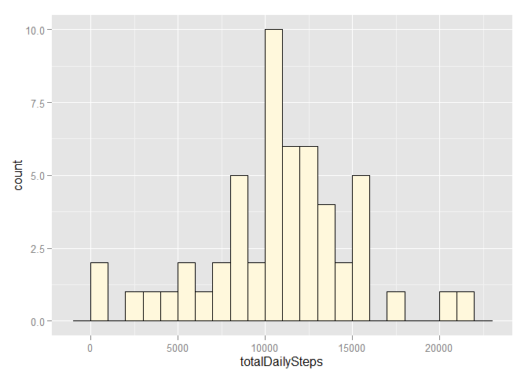
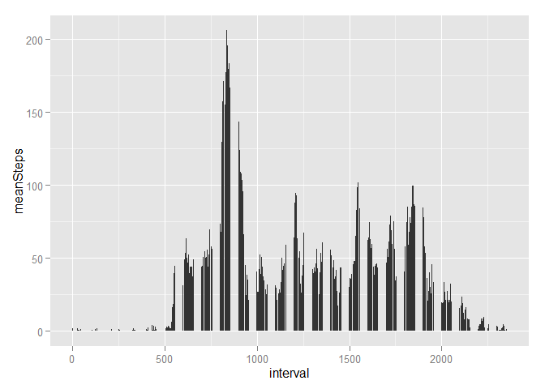
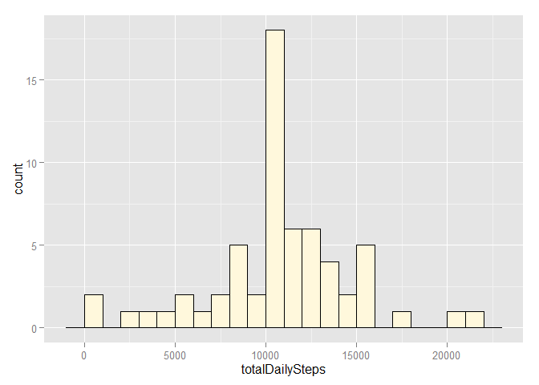

# Reproducible Research: Peer Assessment 1

## Loading and preprocessing the data


```r
library(dplyr)
```

```
## 
## Attaching package: 'dplyr'
## 
## The following object is masked from 'package:stats':
## 
##     filter
## 
## The following objects are masked from 'package:base':
## 
##     intersect, setdiff, setequal, union
```

```r
library(ggplot2)

# setwd("C:/Users/dlanger/Documents/GitHub/RepData_PeerAssessment1")
dataZipFilePath = "./activity.zip"
dataFilePath <- unzip(dataZipFilePath)
data <- read.csv(dataFilePath)

data$date <- as.Date(data$date, format = "%Y-%m-%d") # Type-cast dates to data type "Date".
#library(lubridate)
#data$date <- ymd(data$date)
```

## What is mean total number of steps taken per day?


```r
data2 <- filter(data, !is.na(steps)) %>%
      group_by(date) %>%
      summarize(totalDailySteps = sum(steps))

ggplot(data2, aes(x = totalDailySteps)) + 
      geom_histogram(binwidth=1000, fill = "cornsilk", colour = "black")
```

 

```r
mean(data2$totalDailySteps)
```

```
## [1] 10766.19
```

```r
median(data2$totalDailySteps)
```

```
## [1] 10765
```

## What is the average daily activity pattern?


```r
data3 <- filter(data, !is.na(steps)) %>%
      group_by(interval) %>%
      summarize(meanSteps = mean(steps))

ggplot(data3, aes(x = interval, y = meanSteps)) + 
      geom_bar(stat="identity")
```

 

```r
data3$interval[which(data3$meanSteps == max(data3$meanSteps))]
```

```
## [1] 835
```

## Imputing missing values


```r
count(filter(data, is.na(steps)))
```

```
## Source: local data frame [1 x 1]
## 
##      n
## 1 2304
```

```r
naIndices = which(is.na(data$steps))

data4 <- data
data4$steps[naIndices] <- data3$meanSteps[match(data4$interval[naIndices], data3$interval)]

data5 <- group_by(data4, date) %>%
      summarize(totalDailySteps = sum(steps))

ggplot(data5, aes(x = totalDailySteps)) + 
      geom_histogram(binwidth=1000, fill = "cornsilk", colour = "black")
```

 

```r
mean(data5$totalDailySteps)
```

```
## [1] 10766.19
```

```r
median(data5$totalDailySteps)
```

```
## [1] 10766.19
```

## Are there differences in activity patterns between weekdays and weekends?
