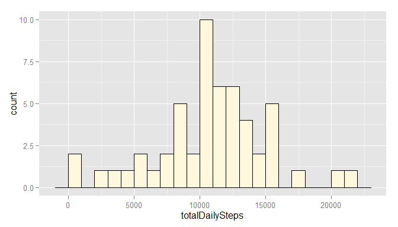
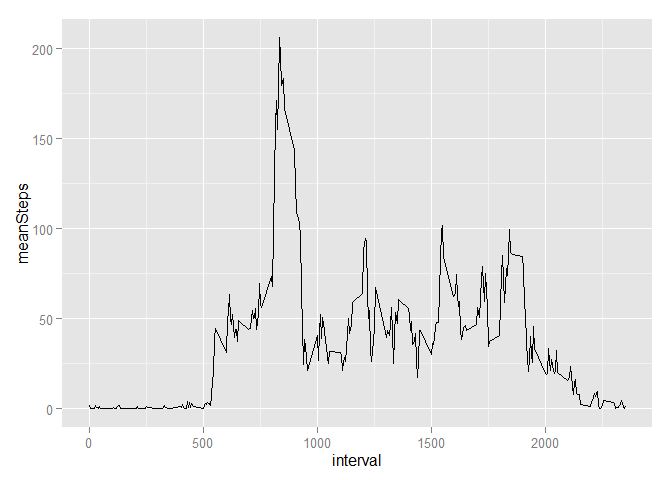
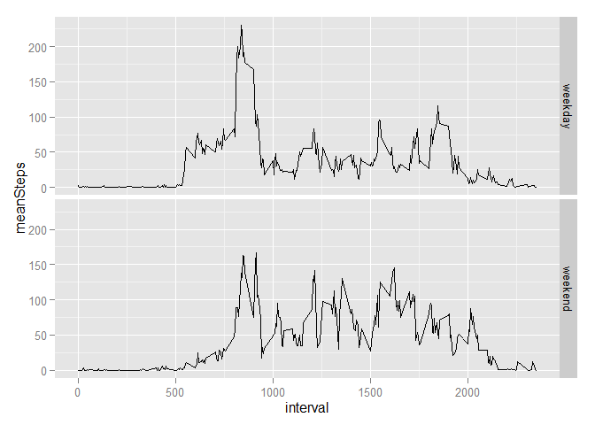

# Reproducible Research: Peer Assessment 1

The code blocks in this document make use of the **dplyr** and the **ggplot2** packages.

```r
library(dplyr)
library(ggplot2)
```

## Loading and preprocessing the data

We unzip and load the data:

```r
dataZipFilePath = "./activity.zip"
dataFilePath <- unzip(dataZipFilePath)
data <- read.csv(dataFilePath)
```

Dates have been loaded as strings, so we type-cast them to the data type *Date*:

```r
data$date <- as.Date(data$date, format = "%Y-%m-%d") 
```

## What is mean total number of steps taken per day?

We calculate the **total number of steps for each day** and display them in a **histogram**:

```r
## Aggregate the data:
data2 <- filter(data, !is.na(steps)) %>%
      group_by(date) %>%
      summarize(totalDailySteps = sum(steps))

## Plot the histogram:
ggplot(data2, aes(x = totalDailySteps)) + 
      geom_histogram(binwidth=1000, fill = "cornsilk", colour = "black")
```

 

Next, we calculate **mean and median of the total number of steps**:

```r
totalStepsPerDay.mean <- as.integer(round(mean(data2$totalDailySteps)))
totalStepsPerDay.median <- as.integer(round(median(data2$totalDailySteps)))
```
Rounded to the next integer, the mean is **10766** and the median is **10765**.

## What is the average daily activity pattern?

We calculate the **average number of steps taken for each 5-minute interval** (averaged across all days) and display it in a time series plot:

```r
## Aggregate the data:
data3 <- filter(data, !is.na(steps)) %>%
      group_by(interval) %>%
      summarize(meanSteps = mean(steps))

## Plot a line graph:
ggplot(data3, aes(x = interval, y = meanSteps)) + 
      geom_line()
```

 

Next, we calculate the 5-minute **interval, on average across all the days in the dataset, that contains the maximum number of steps**:

```r
intervalWithMaxSteps <- data3$interval[which(data3$meanSteps == max(data3$meanSteps))]
```
We find that **interval 835** on average contains the maximum number of steps. 

## Imputing missing values
There are a number of days/intervals in the original data where there are missing values (coded as NA). The presence of missing days may introduce bias into some calculations or summaries of the data.

First, we calculate and report the **total number of missing values** in the dataset (i.e. the total number of rows with NAs):

```r
numberOfMissingValues <- count(filter(data, is.na(steps)))[1, 1]
```
The number of missing values is **2304**.

Next, we **replace each NA with the average number of steps of the corresponding interval** (averaged across all days, as calculated in the previous section). 

```r
naIndices = which(is.na(data$steps))

data4 <- data
data4$steps[naIndices] <- data3$meanSteps[match(data4$interval[naIndices], data3$interval)]
```

To compare with the data before imputing missing values, We calculate the **total number of steps for each day** (now from the new dataset) and display them in a **histogram**:

```r
data5 <- group_by(data4, date) %>%
      summarize(totalDailySteps = sum(steps))

ggplot(data5, aes(x = totalDailySteps)) + 
      geom_histogram(binwidth=1000, fill = "cornsilk", colour = "black")
```

 

As for the original data, we also calculate **mean and median of the total number of steps** from the new dataset:

```r
totalStepsPerDay.mean.new <- as.integer(round(mean(data5$totalDailySteps)))
totalStepsPerDay.median.new <- as.integer(round(median(data5$totalDailySteps)))
```

Rounded to the next integer, the mean is **10766** and the median is **10766** (compared to 10766 and 10765, respectively, before imputing missing values).

## Are there differences in activity patterns between weekdays and weekends?
We create a **new factor variable** in the dataset indicating whether a given date is a **weekday or weekend day**. Note that we start from the new dataset created in the previous section, in which missing values have been replaced with best estimates.

```r
data6 <- data4

data6$weekday <- as.POSIXlt(data$date)$wday
data6$dayType <- factor("weekday", c("weekday", "weekend"), labels = c("weekday", "weekend"))
data6$dayType[data6$weekday %in% c(0, 6)] <- factor("weekend", c("weekday", "weekend"), labels = c("weekday", "weekend"))
```

With the enriched dataset, we create a **facetted time-series plot comparing the time series average number of steps taken for weekdays vs. weekend days**:

```r
data7 <- filter(data6, !is.na(steps)) %>%
      group_by(interval, dayType) %>%
      summarize(meanSteps = mean(steps))

ggplot(data7, aes(x = interval, y = meanSteps)) + 
      geom_line() +
      facet_grid(dayType ~ .)
```

 

Three **interesting observations** can be made from the comparison of the two above plots:

*   On average, significant activity starts and ends somewhat later on weekends than on weekdays. This does not come as a surprise given that many people with a regular job typically get up later in the morning and might go out in the evening relatively more often on weekends than on weekdays.
*   On average, activity is more evenly distributed over the active part of the day on weekends compared to weekdays. We might hypothesize that the test subject has a job we they are mostly sitting (e.g. an office job) and is more active on weekends, e.g. while going shopping.
*   On average, there is a rather high peak of activity in the morning of weekdays. We might hypothesize that the test subject typically goes jogging in the morning of weekdays.
